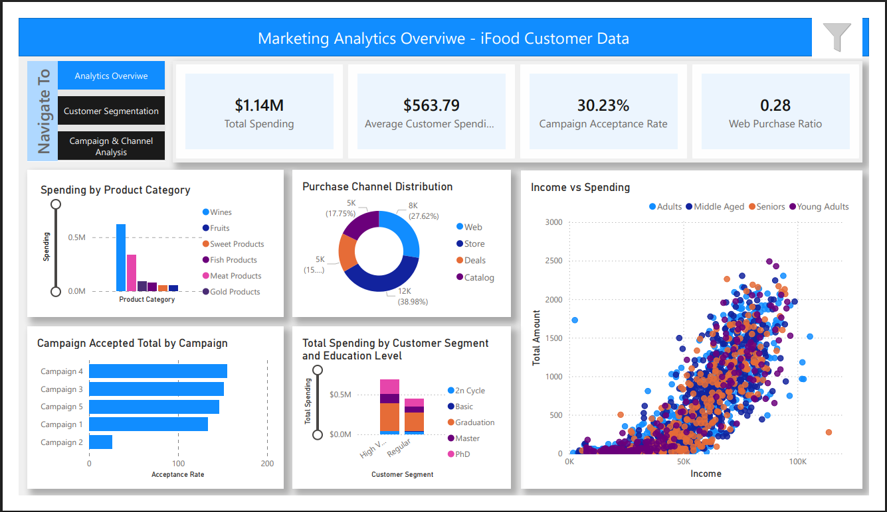
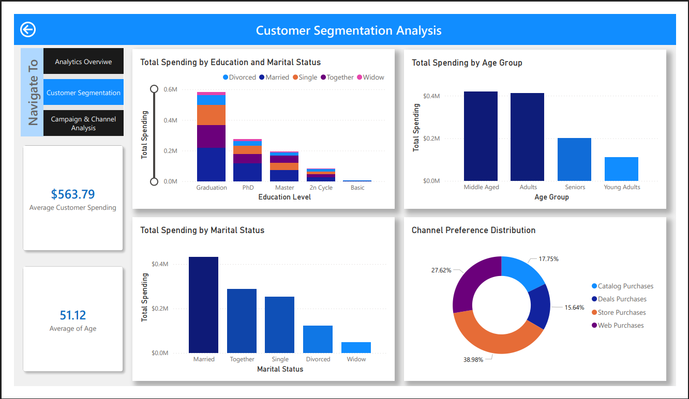
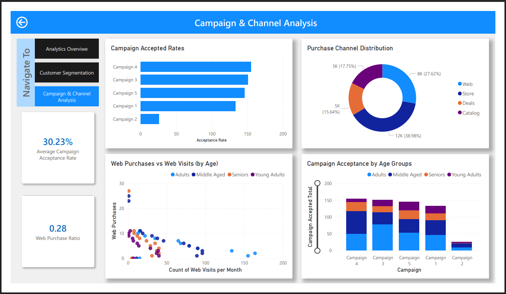
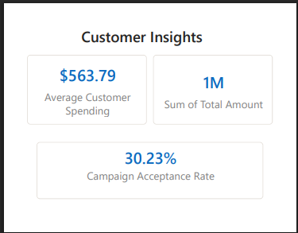
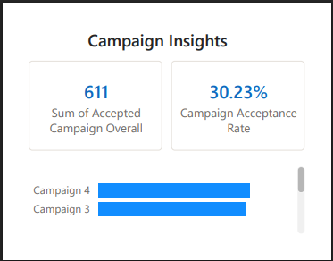
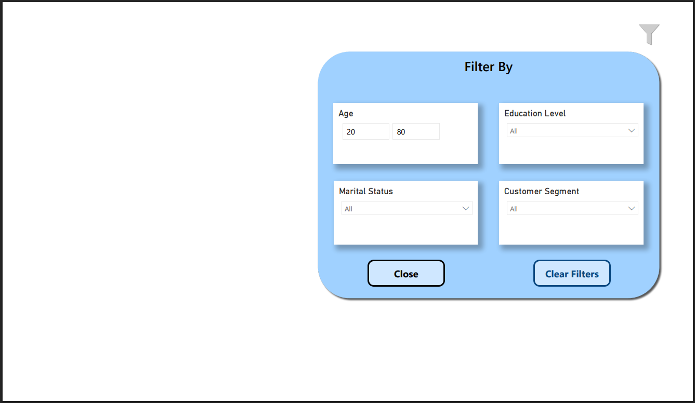

# Marketing Analytics Dashboard – Power BI
Dashboard with Power BI - Marketing Analytics - iFood Customer Data

## Overview

This project presents a comprehensive Marketing Analytics Dashboard developed in Microsoft Power BI based on the iFood customer dataset.

The dashboard provides insights into:

* Customer spending behavior
* Campaign performance
* Purchase channel effectiveness
* Customer segmentation
* Interactive filtering and navigation

The solution was designed to support marketing decision-making through interactive visual analytics and KPI monitoring.

## Dashboard Pages
### 1. Marketing Analytics Overview

The main dashboard provides a high-level summary of marketing performance and customer purchasing behavior.

**Key Features**
* Total Spending KPI
* Average Customer Spending
* Campaign Acceptance Rate
* Web Purchase Ratio
* Spending by Product Category
* Purchase Channel Distribution
* Income vs Spending Analysis
* Customer Segment Spending Comparison

This page acts as the central analytical hub of the report. It enables stakeholders to quickly evaluate overall marketing effectiveness, identify top-performing product categories, and analyze customer purchasing trends across different channels.

### 2. Customer Segmentation Analysis
   
**Features**
* Spending by Marital Status
* Spending by Education Level
* Age Group Analysis
* Channel Preference Distribution
* Customer Demographics Insights
  

This dashboard focuses on customer demographics and behavioral segmentation. It helps identify which customer groups contribute the most revenue and how purchasing behavior varies among segments.

### 3. Campaign & Channel Analysis
**Features**
* Campaign Acceptance Rates
* Acceptance by Age Groups
* Web Purchases vs Web Visits
* Purchase Channel Distribution
* Campaign Performance KPIs

This page evaluates marketing campaign effectiveness and customer interaction across purchase channels. It assists in measuring campaign engagement and identifying the most effective communication channels.

*Custom Tooltips*

Two custom tooltip pages were designed to improve interactivity and provide additional contextual insights without overcrowding the main dashboards.

### 4. Customer Insights - Tooltip 1

**Displays:**
* Average Customer Spending
* Total Spending
* Campaign Acceptance Rate

### 5. Campaign Insights - Tooltip 2

**Displays:**
* Total Accepted Campaigns
* Campaign Acceptance Rate
* Campaign-wise performance metrics

These tooltips enhance user experience by providing quick access to detailed metrics when hovering over visuals.

### 6. Slicer Panel

An interactive slicer panel was added to the main dashboard for dynamic filtering.

**Included Filters:**
* Age
* Education Level
* Marital Status
* Customer Segment
* Additional Features
* Clear Filters button
* Open/Close slicer panel navigation

The slicer panel improves dashboard usability by allowing users to perform customized analysis based on selected customer characteristics.
